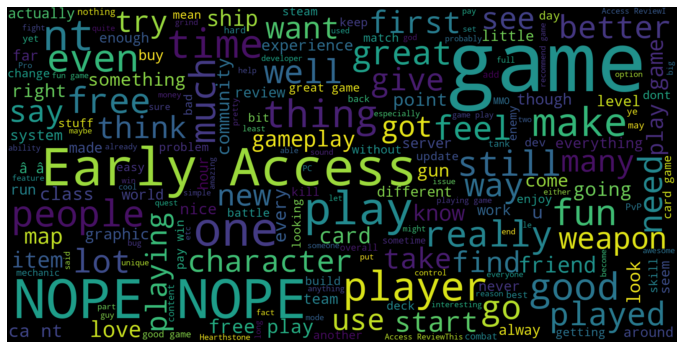
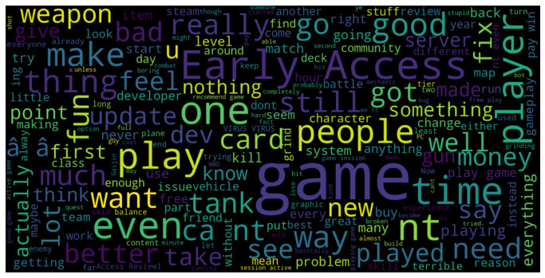
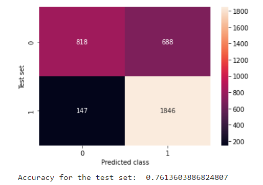

# Sentiment_Analysis

## Project Description.

This project was a sentiment analysis model written in Python using the NLTK libraries.
It is meant to show a level of understanding and proficiency of NLP processes.
The dataset used for training was of movie reviews.

## Results

### Word Clouds

#### Positive
A word cloud generated from positive reviews was as seen

#### Negative
A word cloud generated from negative reviews was as seen

### Confussion Matrix
The confussion matrix generated and accuracy after testing are as seen

